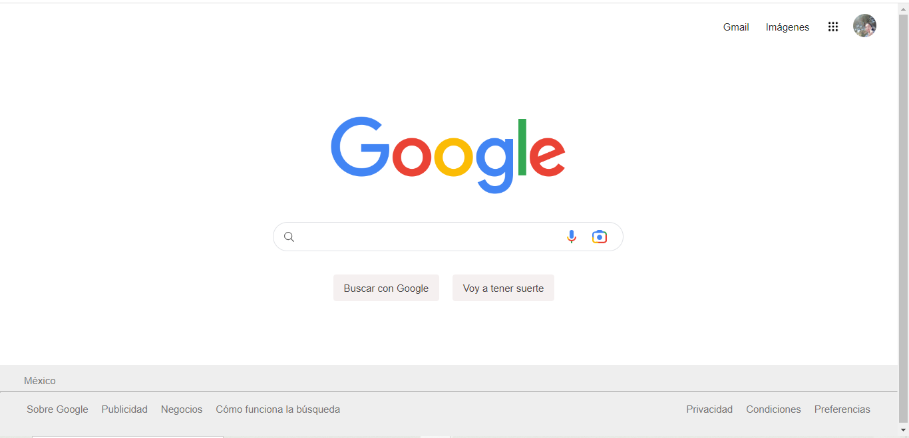

# Google Interface Clone

This repository contains the source code for a simple clone of the Google interface created during the TECNOLOCHICASpro bootcamp. HTML and CSS were used to recreate the Google homepage.

## Screenshot

## Features

- Clone of the Google homepage.
- Implemented using HTML and CSS for the layout.

## Cloning Instructions

1. Clone this repository to your local machine using the following command.

2. Open the `index.html` file in your web browser to view the Google interface clone.

## Credits

This clone was created as part of the TECNOLOCHICASpro bootcamp. Special thanks to the instructors and mentors for their guidance and support.

